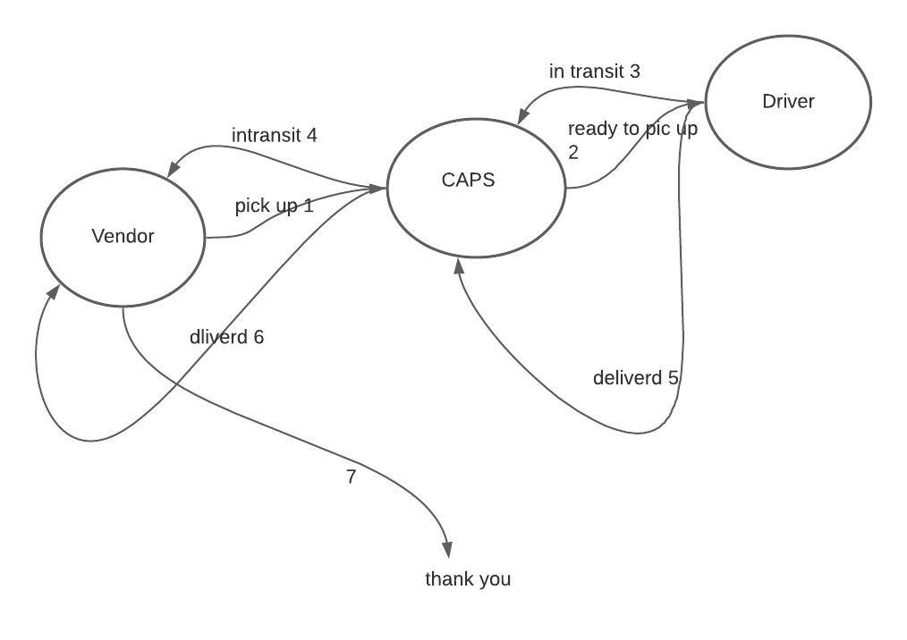

# LAB - Class 08

## Project:bearer-auth

### Author: Mohammad Amjad Alazzam

### Links and Resources

- [ci/cd](https://github.com/MohdAzzam/CAPS-/actions)

### Setup

#### `.env` requirements (where applicable)

- STORENAME=

#### How to initialize/run your application (where applicable)

- `npm start`

#### How to use your library (where applicable)

- `npm install `

#### Tests

- How do you run tests? `npm test`

#### UML

